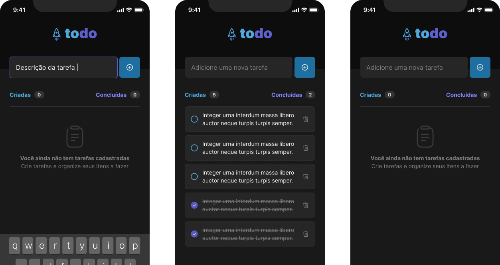

<h1 align="center">
    
</h1>

## 💻 Projeto

Projeto desenvolvido na trilha de React Native do Ignite da Rocketseat, com a finalidade de ser um controle de tarefas, para praticar os conceitos de estados, imutabilidade do estado, listas e chaves no React Native, propriedades e componentização.

## 🧪 Tecnologias

Este projeto foi desenvolvido com as seguintes tecnologias

- [React Native](https://reactnative.dev/)
- [Expo](https://expo.dev/)
- [TypeScript](https://www.typescriptlang.org/)

## 🚀 Como instalar

```bash
# Clone este repositório.
# Entre na pasta do projeto

# Instale as dependências
$ npm install

# Execute aplicação
$ npm run dev

```

---

<p>Feito com 💜 by Lucas Barque da Silva</p>

[](https://www.linkedin.com/in/lucas-barque/)
[](mailto:lucasbarquedasilva@hotmail.com)
